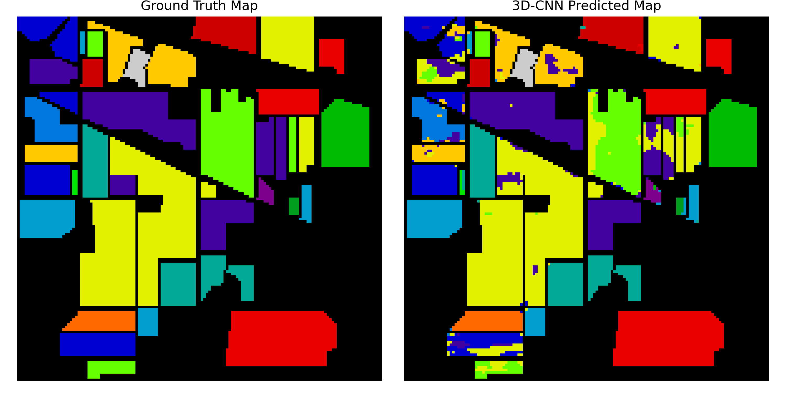
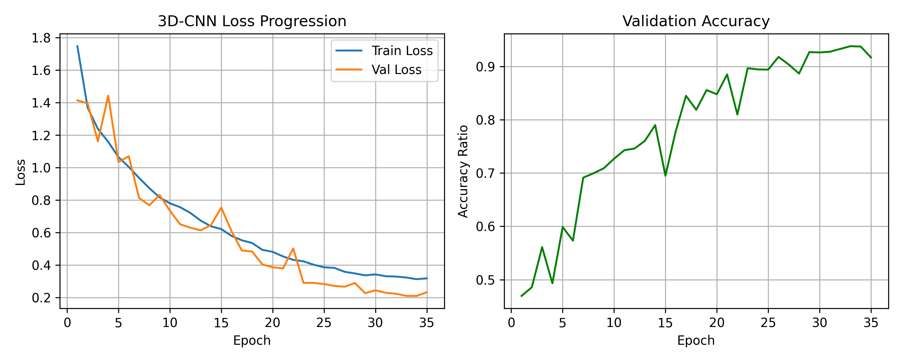

## Hyperspectral Image Classification using 3D-CNN

[](https://pytorch.org/)
[]()

## 📌 Abstract
Standard computer vision models operate on 3-channel RGB images, which flatten color information and discard continuous light spectra. This repository provides a PyTorch implementation of a custom **3D Convolutional Neural Network (3D-CNN)** designed for the joint spatial-spectral classification of hyperspectral remote sensing data. By sliding volumetric kernels simultaneously across spatial dimensions ($H \times W$) and spectral depth ($\text{Bands}$), the model extracts both physical layout and unique chemical light signatures for precise land-cover classification.

> **Architecture Reference:**  
> Li, Y., Zhang, H., & Shen, Q. (2017). *Spectral–spatial classification of hyperspectral imagery with 3D convolutional neural network.* Remote Sensing, 9(1), 67. DOI: [10.3390/rs9010067](https://doi.org/10.3390/rs9010067)

> **Dataset Reference:**  
> Baumgardner, M. F., Biehl, L. L., & Landgrebe, D. A. (2015). *220 Band AVIRIS Hyperspectral Image Data Set: June 12, 1992 Indian Pines Test Site.* Purdue University Research Repository (PURR). DOI: [10.4231/R7RX991C](https://doi.org/10.4231/R7RX991C)

---

## 🏗️ Architecture & Methodology

* **Patch Extraction:** Extracts localized $9 \times 9$ spatial windows around each target pixel while meticulously preserving all 200 deep spectral channels.
* **Volumetric Convolutions:** Implements `nn.Conv3d` blocks to process the structural data in its native 3D cube shape, represented as tensors of size $(N, 1, \text{Bands}, 9, 9)$.
* **Joint Feature Extraction:** Unlike 2D networks that only analyze spatial shapes, the 3D-CNN simultaneously processes structural topography and distinct spectral light signatures to boost classification accuracy.

---

## 🛠️ Experimental Setup & Configuration

| Parameter | Configuration |
| :--- | :--- |
| **Dataset** | AVIRIS Indian Pines Benchmark ($145 \times 145$ pixels, 200 continuous spectral bands). |
| **Data Samples** | $10,249$ annotated spatial-spectral training and testing pixels. |
| **Target Classes** | 16 land-cover categories (e.g., Agriculture, Natural Cover, Infrastructure). |
| **Architecture** | Custom 3D Convolutional Neural Network (`nn.Conv3d`). |
| **Loss Function** | Cross-Entropy Loss |
| **Optimizer & Scheduler** | AdamW with Cosine Annealing Learning Rate Scheduler (35 Epochs). |

---

## 📊 Results & Visualization

### Spatial Classification Map
The model demonstrates strong convergence, successfully generating a full-terrain classification map across 16 agricultural land-cover categories with a peak validation accuracy of **85.5%+**. 



### Training Progression
The model was optimized using Cross-Entropy Loss combined with an AdamW optimizer and a Cosine Annealing learning rate scheduler to stabilize convergence across 35 epochs.



---

## 📂 Repository Structure

<pre>
hyperspectral-3d-cnn/
├── models/
│   └── hyperspectral_3d_cnn.pth    # Saved best model weights
├── notebooks/
│   └── hyperspectral_3d_cnn.ipynb  # training and evaluation
├── results/
│   ├── training_metrics.png        # Loss & accuracy tracking curves
│   └── classification_results.png  # Full terrain prediction map 
└── README.md                       # Project documentation
</pre>

---


##  Quick Start (Reproduction)

```bash
git clone https://github.com/imajidhussain/hyperspectral-3d-cnn                            
cd hyperspectral-3d-cnn 
